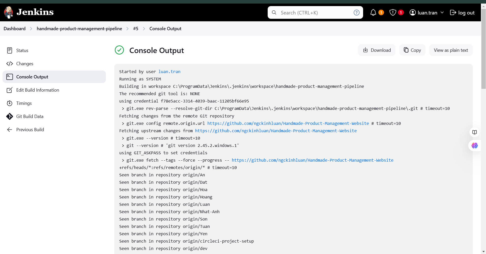

# Handmade Product Management Website 🎨🛒

Welcome to the **Handmade Product Management Website**! This is a feature-rich ASP.NET project designed using **Blazor Pages** for an interactive front-end experience and a robust back-end API. Deployed to **Microsoft Azure**, the project incorporates modern CI/CD practices with **GitHub Actions**, **CircleCI**, and **Jenkins** to ensure smooth continuous delivery and deployment.

---

## 🎯 Features

- **User Management**: Seamless registration and login with support for **Google** and **Facebook authentication**.
- **Product Management**: Add, update, delete, and manage your handmade products.
- **Promotions**: Create and manage promotions for your products with validation logic.
- **GraphQL API**: Support for efficient and flexible data querying and manipulation.
- **Firebase Integration**: Used for real-time database and authentication.
- **CORS Support**: Enable cross-origin requests for enhanced flexibility.
- **Responsive Design**: User-friendly interface for all devices.

---

## 🚀 Tech Stack

### Front-End:
- **ASP.NET Blazor Pages**: For building dynamic and interactive web interfaces.

### Back-End:
- **ASP.NET Core**: For a scalable and secure server-side framework.
- **GraphQL**: Efficient API queries for dynamic data interaction.
- **Firebase**: Real-time database and authentication.

### DevOps & Deployment:
- **Azure**: Hosting and deployment of the application.
- **GitHub Actions**: For CI/CD pipelines and automated testing.
- **CircleCI**: For additional CI/CD workflows ensuring high reliability.
- **Jenkins**: For building and deploying various components.

---

## 📦 Installation

Follow the steps below to set up the project locally:

### Prerequisites:
- **.NET 8 SDK** or later
- **Node.js** (for front-end dependencies if required)
- **Azure CLI** (for deployment)
- **Git** (for version control)

## Images
- This application also uses CircleCI, Jenkins and Github Actions to facilitate the CI/CD pipelines.

  
